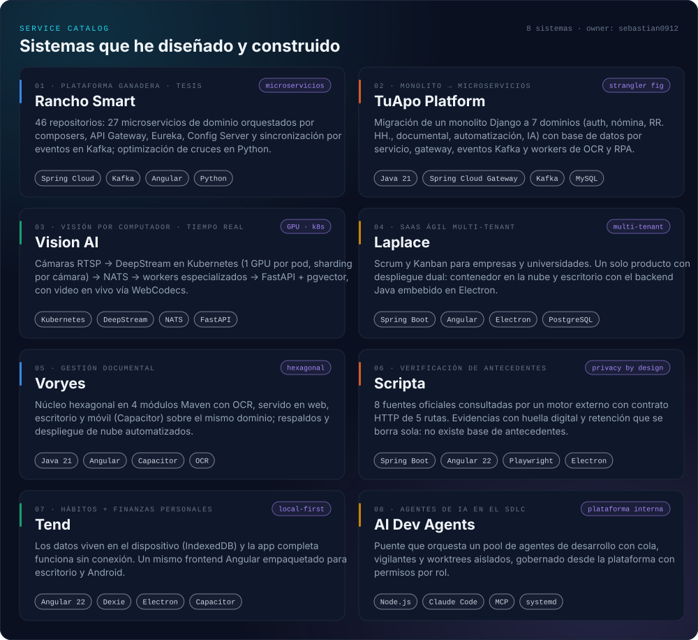
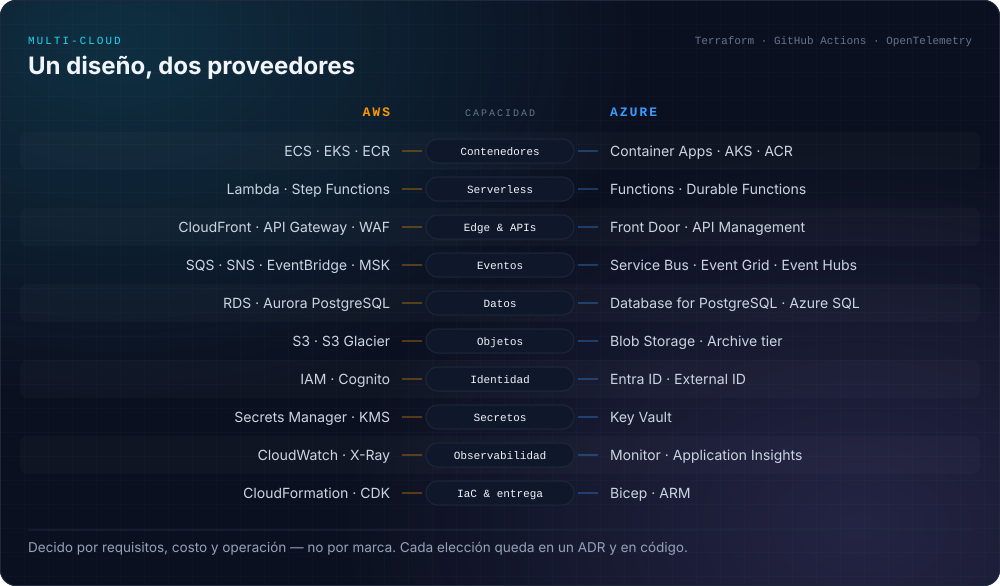

<div align="center">



<br/>

<a href="https://www.linkedin.com/in/sebastian-guarnizo-campos-b619731b6/"></a> <a href="mailto:sebstiangc555@gmail.com"></a>

</div>

<br/>

```yaml
apiVersion: people/v1
kind: Engineer
metadata:
  name: sebastian-guarnizo-campos
  location: Bogotá, Colombia
spec:
  roles: [software-architect, cloud-architect, senior-software-engineer]
  clouds: [aws, azure]
  designs: [microservices, event-driven, hexagonal, multi-tenant, local-first]
  ships: [web, desktop, mobile, gpu-pipelines]
  documents: every-decision   # ADRs, no folclore
status:
  phase: Building
  openTo: [architecture, cloud, platform-engineering]
```

Diseño y construyo plataformas de punta a punta: desde el dominio y los límites entre servicios hasta la infraestructura, la observabilidad y el instalador que llega al usuario. Me importa que un sistema **escale, se pueda auditar y siga siendo mantenible dentro de cinco años**, no solo que pase la demo.

<table>
<tr>
<td width="33%" valign="top">

**◆ Arquitectura de software**

Microservicios con Spring Cloud, arquitectura hexagonal, eventos con Kafka y NATS, migraciones de monolito con *strangler fig*, multi-tenancy y decisiones registradas en ADRs.

</td>
<td width="33%" valign="top">

**◆ Arquitectura cloud**

Diseño sobre AWS y Azure: contenedores y Kubernetes, edge y gateways, mensajería gestionada, identidad, secretos, observabilidad e infraestructura como código.

</td>
<td width="33%" valign="top">

**◆ Ingeniería senior**

Java 21 / Spring Boot, Angular, Python / FastAPI, Electron y Capacitor. CI/CD con GitHub Actions, pruebas que de verdad pueden fallar y agentes de IA en el ciclo de desarrollo.

</td>
</tr>
</table>

<br/>



<br/><br/>



<br/><br/>



<br/><br/>

### ◇ Decisiones que defiendo

Extraídas de los ADRs de mis proyectos. Cada una nació de un problema real.

| ADR | Decisión | Por qué |
|:---:|---|---|
| `VIS‑0044` | **Un test que no puede fallar es peor que no tenerlo.** | Sale en verde y ocupa el lugar de la comprobación que nadie escribirá porque "ya está cubierto". |
| `VIS‑0043` | **Una perilla que no mueve nada es peor que no tenerla.** | Un mando que el operador cree tener miente sobre lo que pasaría al tocarlo. |
| `VIS‑0040` | **Una regla de autorización se escribe una vez.** | Dos copias del mismo predicado reciben arreglos distintos y terminan divergiendo. |
| `VIS‑0041` | **La documentación de un incidente no puede mentir.** | Runbooks y guías se leen en plena crisis, cuando nadie tiene tiempo de verificar. |
| `VIS‑0046` | **El mapa lo verifica el código.** | La arquitectura documentada es lo primero que envejece; un test la mantiene honesta. |
| `SCR‑0003` | **Sin base de datos de antecedentes.** | Guardar y reutilizar consultas es la optimización obvia… y es exactamente el delito. Retención con purga. |

<br/>



<br/><br/>


<div align="center">
<sub>Todo lo visual de este perfil es código: <code>scripts/build_assets.py</code> genera los diagramas y <code>scripts/telemetry.py</code> renueva la telemetría cada día con GitHub Actions — sin servicios de terceros.</sub>
</div>
